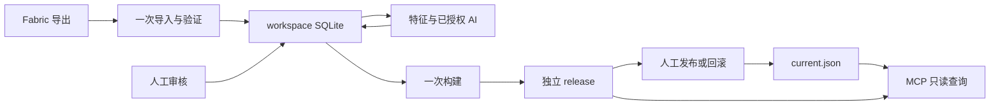

# Blockpedia 架构

当前执行 [D-054 重构规格](export-build-refactor-spec.md)。早期阶段证据保留在路线图和 decisions 的历史段落；旧验证链不作为当前架构要求。

## 组件

Fabric 是注册表枚举、代表状态和游戏内渲染的唯一执行者。Studio 只投影导出、提取离线特征、执行已授权标注、保存审核并生成 release。

SQLite 提交结果拥有 workspace 业务事实。进度、日志、旧 generated JSON 和 artifacts 索引不拥有任务成功事实。原始机器事实、AI 语义和人工覆盖分层保存，人工覆盖按稳定顺序重放。

release 构建后独立于 workspace。发布只改变 current，回滚指向另一份已有 release；不修改 release 内容。MCP 读取 current 指向的精确版本，无隐式历史回退，无 provider 或 Keyring 依赖，无持久化写入。

## 技术与运行边界

现有 Minecraft Java 26.2、Java 25、Fabric Loader 0.19.3、Fabric API 0.157.0+26.2、Loom 1.17.19、Gradle 9.5.1、CPython 3.14.7 基线保留。26.2 使用 native Mojang names；Python 栈继续使用 FastAPI/Jinja2/HTMX、SQLite、本地文件和进程内 Worker。不增加服务、队列、迁移框架或依赖。

产品 CLI 只有 block-index web 和 block-index mcp。Web 只绑定 127.0.0.1:8765，写操作由 WebUI 发起；MCP 只有 stdio 和既有四工具。一个 data-root 仅允许一个可写 Studio；其他进程可以只读 MCP。

正式支持目标仍为 Windows 11 x86_64 和 Linux x86_64。开发机上的其他平台验证不扩大支持范围，也不替代缺失的平台实测。

## 数据与提交点

- 导入使用私有 staging，一轮读取同时完成验证、复制和投影，再原子提交 workspace。
- 特征/AI 结果与 job 状态在 SQLite 同事务提交；本地未提交计算可显式恢复，未知 AI 发送结果不得自动重发。
- 构建持有 run 锁，使用一个一致读视图和一份投影逻辑；必要的业务检查、产物持久化和原子 rename 后，final 就是构建事实。
- 发布持有指针切换锁，通过小型 current token 防止陈旧页面覆盖。一次确认直接发布，不需要两个候选或中间检查许可证。
- 发布意图/结果写入独立审计日志，审计失败不能把已经发生的 current 替换伪装成未执行。

导入/构建/发布不执行本地篡改检测。业务格式、状态引用、覆盖、审核、路径边界和写入持久化仍须成立。具体流程与故障语义由 [流水线文档](pipeline-storage-and-publishing.md) 拥有。

## 兼容与保留

workspace SQL 不迁移，已成功的标注、覆盖和审计不重跑、不删除。旧 stage 标签作为历史/接线字段继续读取。普通 exporter 保留 camera.v2 的 banner 居中缩放修复；专用 banner-repair 和 WebUI refresh 退出产品路径，已有 mixed lineage 仍可读取。

新 release 使用六项布局和已有 v2 index；旧 v2 release 无需 workspace 或 check cache 即可发布。旧 v1 保留历史，不伪装成具备 v2 查询投影。Schema 的精确字段由真实 JSON 文件拥有，说明文档不维护第二套逐字段定义。
